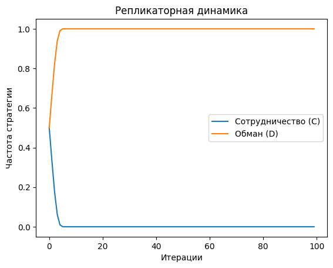

Модель алгоритма игры с неполной информацией и репликаторной динамикой, которая описывает, как стратегии распространяются в популяции, где игроки имеют ограниченную информацию о стратегиях других участников. 



Основные шаги алгоритма:
### 1. Определение игры
- **Игроки**: Количество игроков в популяции.
- **Стратегии**: Набор возможных стратегий, которые могут использовать игроки.
- **Выплаты**: Матрица выплат, которая показывает, какие выплаты (или приспособленность) получают игроки в зависимости от выбранных стратегий.

### 2. Начальные условия
- **Начальные частоты стратегий**: Начальные частоты каждой стратегии в популяции. Эти частоты могут быть случайными или заданными.

### 3. Репликаторная динамика
- **Вычисление средней приспособленности**: Средняя приспособленность, которая зависит от частот других стратегий в популяции.
- **Обновление частот стратегий**: Частоты стратегий в популяции на основе их средней приспособленности. Стратегии с более высокой приспособленностью будут увеличивать свою частоту, а стратегии с более низкой приспособленностью — уменьшать.

### 4. Итерации
- **Повторение шагов**: Повторяйте шаги вычисления средней приспособленности и обновления частот стратегий на каждом временном шаге. Это позволяет моделировать, как стратегии распространяются в популяции со временем.

### 5. Анализ результатов
- **Стабильность стратегий**: К каким стабильным состояниям приводит динамика. Это может включать анализ эволюционно стабильных стратегий (ESS) и других устойчивых состояний.
- **Визуализация**: Изменение частот стратегий со временем для лучшего понимания динамики процесса.

### Пример
Рассмотрим простую игру с двумя стратегиями: "Сотрудничество" (C) и "Обман" (D).

1. **Определение игры**:
   - Игроки: 100 игроков.
   - Стратегии: C и D.
   - Матрица выплат:
     ```
     |       | C       | D       |
     |-------|---------|---------|
     | C     | (3, 3)  | (0, 5)  |
     | D     | (5, 0)  | (1, 1)  |
     ```

2. **Начальные условия**:
   - Начальные частоты: 50% игроков используют стратегию C, 50% — стратегию D.

3. **Репликаторная динамика**:
   - Вычисление средней приспособленности для каждой стратегии.
   - Обновление частот стратегий на основе их средней приспособленности.

4. **Итерации**:
   - Повторение шагов вычисления и обновления на каждом временном шаге.

5. **Анализ результатов**:
   - Анализ стабильных состояний и визуализация изменения частот стратегий со временем.

Этот алгоритм позволяет моделировать, как стратегии распространяются в популяции под воздействием естественного отбора, даже когда игроки имеют неполную информацию о стратегиях других участников.